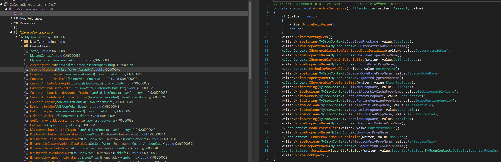

## Introduction

Microsoft asked us to [try the new source generator for JSON](https://devblogs.microsoft.com/dotnet/try-the-new-system-text-json-source-generator/).

The promise of a source generator for JSON serialization is that of reduce startup times as the generation code can be pre-generated during the build step rather than during runtime.

Also, source generators are less magic than dynamic type generation in .NET.

I inspected the generated code from the source generator and found that it did generate a quite nice serialize function but the deserializer relied on the metadata generated by the source generator.

Deserialization is rather complex as there's a need to specify converters and how to resolve property names as the JSON idiom is camel casing where in .NET it's pascal casing.

As a person interested in code generation I was wondering how well a version based around T4 would stack up against the new source generator especially if I took the freedom to ignore corner cases Microsoft had to consider for a generic source generator.

## T4 vs Source Generator

For me, source generators are too complex a machinery to bother with. I used T4 for 10+ years and is happy with it, I realize I am in a minority.

So when I need source generation I goto T4.

## The model

Source generators relies on the C# code as a model of what should be generated, a source generator developer traverses the analyzer tree from Roslyn to generate code.

While this has several benefits I do prefer defining a specialized model in T4 that only contain the information I need and nothing else.

Using C# code as model creates complexities for the source generator creator as C# code is more expressive than what makes sense for a the code generation and when needing additional metadata attributes has to be defined and used.

In this example I use this model to define my C# POCO records and serialize and deserialize methods.

```csharp
  var model = new []
  {
    C(  "Person"
      , ("int"                ,     "Id"        )
      , ("string"             ,     "FirstName" )
      , ("string"             ,     "LastName"  )
    ),
  };
```

It generates a POCO record like so:
```csharp
  partial record Person
  {
    public int    Id        { get; set; }
    public string FirstName { get; set; }
    public string LastName  { get; set; }
  }
```

This is matches the `Person` classed used in the blog post by Microsoft to do performance tests with.

In addition it generalize extension methods so that you can serialize and deserialize a `Person`.

```csharp
List<Person> SlowClone(List<Person> ps)
{
  // Serialize List<Person> to a JSON byte array
  byte[] bs = ps.Serialize();
  List<Person> pps;
  // Deserialize the JSON byte array into a List<Person>
  bs.Deserialize(out pps);
  return pps;
}
```

## The generator (T4)

Given the model the T4 code iterates over it and generate the POCO records and the serialize and deserialize methods. It's not very complicated as the model is simple, iterate over the model and generate code:

```
<# foreach (var classDef in model) { #>
  // --------------------------------------------------------------------------
  partial record <#=classDef.Name#>
  {
<# foreach (var (ptype, pname) in classDef.Properties) { #>
    public <#=RightPad(ptype, 20)#> <#=RightPad(pname, 30)#> { get; set; }
<# } #>
  }
  // --------------------------------------------------------------------------

<# } #>
```

This is the T4 code to generate the POCO records. It is basically PHP or old-school ASP.

One strong argument for source generators is good tooling that already exists. You reference a nuget package and annotate some classes with meta data and you are good.

For whatever reasons the tooling around T4 is poor and while it's possible to make reusable templates you have to figure out a way to distribute them. Nuget has been awkward for me and I usually rely on git submodules these days as a redistribution mechanism.

## Performance!

So how does it the T4 generated stack up against the source generator?

I created 8 different test cases:

1. Deserialize.Consume - Baseline, just consume all tokens parsed by Utf8JsonReader. Used to estimate the overhead of creating objects from the token stream.
1. Deserialize.JsonSerializer - Deserializes `Person` objects using the classic JsonSerializer
1. Deserialize.T4JsonSerializer - Deserializes `Person` objects using the T4 generated code
1. Deserialize.SourceGenerator - Deserializes `Person` objects using the JSON source generator preview `6.0.0-rc.1.21404.6`
1. Serialize.HardCoded - Baseline, serializes `Person` objects using a hand written function
1. Serialize.JsonSerializer - Serializes `Person` objects using the classic JsonSerializer
1. Serialize.T4JsonSerializer - Serializes `Person` objects using the T4 generated code
1. Serialize.SourceGenerator - Serializes `Person` objects using the JSON source generator preview `6.0.0-rc.1.21404.6`

In addition each test case is executed 3 times with:

1. 10 objects
2. 100 objects
3. 1000 objects

This in order to measure any wind-up performance

### Time consumed chart

This was the time spent in seconds on the different use cases. Lower is better.


[Interactive chart for time spent in seconds](pages/times.html)

We see that the hard coded, the T4 generated and the source generated serializers performs roughly equal. This is not surprising after looking at the generated code that are almost identical for all 3 cases.

There are more differences when deserializing the objects.

First, the consume test case is the fast naturally as just iterates through the tokens but take little actions. This is the base line.

The source generated deserializer does better than the classic JsonSerializer as we hoped. This is likely because of some preprocessing done by the source generator. However, looking at the generated code it seems that the deserializer does depend on metadata and not a pre-generated method such as when serializing json.

This is likely why the T4 generated deserializer does a bit better as it has generated methods for deserialization.

The source generator supports more features that the T4 generated code currently don't and if you have classes with a large amount of attributes the linear search utilized by the T4 generated code will likely perform worse.

The overhead incurred by the T4 generated code from the base line seems to be around 15% which isn't bad IMO.

### Number of GC collects chart

This shows how many times the GC was executed during the test. If alot of objects are created that creates memory pressure that triggers a GC. Lower is better.


[Interactive chart for number of times GC executed](pages/collects.html)

As with the CPU time spent the hard coded, t4 generated and the source generated serializer has similar memory properties due to almost identical code.

For the deserializer the T4 generated code does better than classic JsonSerializer or source generated especially for smaller collections. Reasons unknown.

## Testing

Testing the generator is rather simple when using property based testing.

Property based testing is identifying properties in code that should always hold and a library like `FsCheck` then generates random test cases.

When it comes to serializers a property that is easy to understand and gives value is that if you serialize C# objects to JSON and back the deserialized objects should be value equal to original objects.

This can be expressed like a property test like this:

```fsharp
// FsCheck works in C# as well but I prefer F#
static member ``Person serialization round-trip`` (indented : bool) (ps : ResizeArray<Person>) =
  let ps  = fixPersons ps
  let e   = ps.ToArray ()
  let bs  = ps.Serialize indented
  let mutable a = ResizeArray<Person> ()
  bs.Deserialize &a
  let a = a.ToArray ()
  e = a
```

`FsCheck` will generate thousands of nasty test cases and the serializer and deserializer should work for all of them.

This together with a few strategic manual tests can give very good confidence.

## Conclusion

The Json source generated code seems to bring faster and more memory efficient JSON serialization to C#.

Since T4 and source generators are closely the source generator code be changed to match the T4 generated code used in this case. There might be good reasons why you wouldn't as deserialization is a bit complex and needs some flexibility, flexibility I have ignored for the sake of performance.

Using the source generator does increase the size of the assembly as expected but I was suprised about how much it was increased.

For the simple `Person` class my assembly went from 7 KiB to 125 KiB. That could be important to keep in mind.

When looking at the generated code it seems there's a lot of meta data that is generated and some of that meta data seems like it is of generic nature that could potentially be moved into `System.Text.Json` but TBH I haven't looked in detail.



Why do we need an `AssemblySerialize`?
